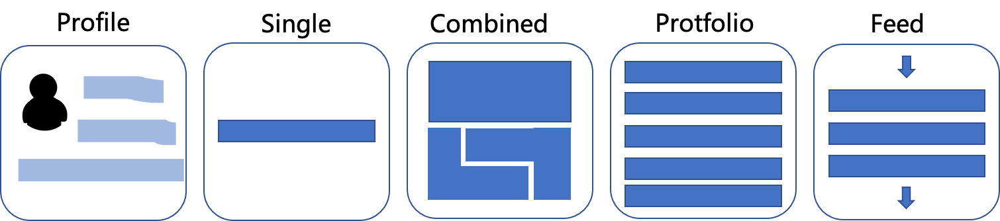
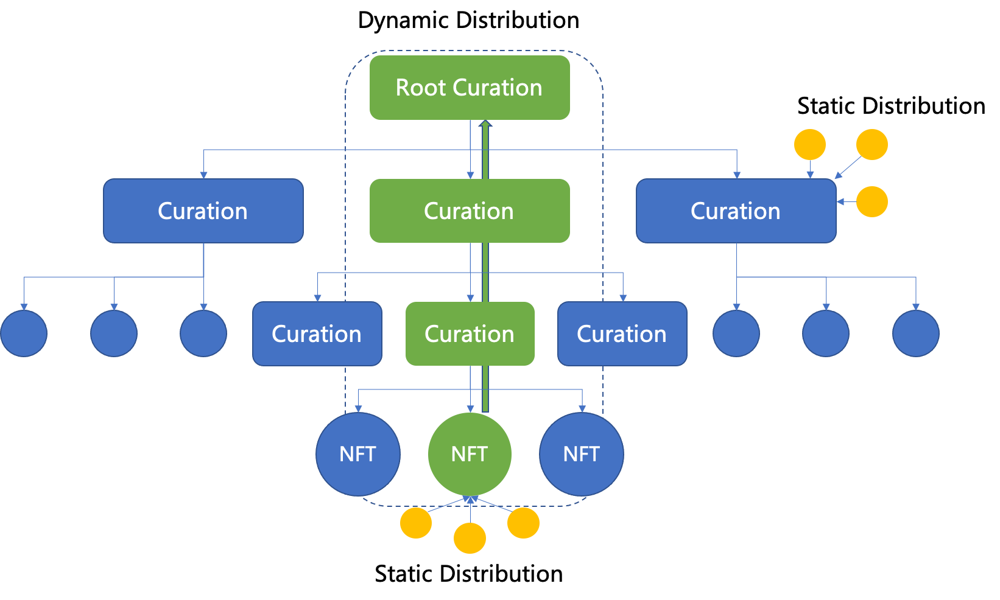

# TheBards Protocol

TheBards is a Creator + Curation + NFT economy system. For simplicity, hereafter collectively referred to as the curation economy. Smart contracts specify the interaction between the four roles (like creator, curator, delegator, developer) and the fair distribution of profits in the system.

# Documentation

For a general overview of the protocol see:

- The [whitepaper]() for the original proposal

# Contracts

## Curation

Curation, as an NFT, is the core of the protocol, that is, it can be cast into a profile that represents the user's identity, or it can be any form of content published by the user, which can be collected and pledged.

### Curation Types

- **$Self\ Curation$**: Presented as a CV or profile NFT that explains who we are, what we have and what we do.
  
- **$Single\ Curation$**: Expressed as basic posts, such as microblogs, articles, audio, video, etc., used to show the creator's gigs, ideas, work, life, knowledge, tastes, etc., which will be minted as NFTs by default, so they can be collected by fans and used as creator's soulband items.
  
- **$Combined\ Curation$**: Various organic combinations of content are also a way of curation, just like the mutual achievement of video and music in tiktok, which will produce a magical chemical reaction.
  
- **$Protfolio\ Curation$**: Equally and purposefully combine content into a list, such as a jazz playlist.
  
- **$Feed\ Curation$**: Featured or specific types of information streams, such as news, funny videos, audio novels, etc.
  

### Stakeholders

Curation should allow nesting, each level of curation can share part of the revenue of NFT sales, and the stakeholders of NFT sales can also be multi-faceted, including creators, curators, delegators, and Developer.

- Creator: Creators publish microblogs, articles, pictures, audios, videos, Q&A, etc. as NFTs.
  
- Curator: Curators are also creators. However, They try to combine different elements to tell a story. Like a literati combining words into prose, like a musician combining notes into a symphony. It is worth noting that the main curation method of this article is combined curation, protfdio curation, and feed curation, excludes the other two special curation types. The TheBards rewards Curators that tell a unique and valuable story earn a share of sale fees of NFTs and rewards.
- Delegator: Delegator are critical to the decentralized curation economy. They use their knowledge or intuition to assess and signal on the curations.  Delegator are economically incentivized to siganl early. By signalling on a curation, you will earn a share of all the curation share revenue that this curation generates. x% of all curation share revenue goes to the delegators pro-rata to their delegation shares.
- Developer: Create a feed curation or use existing data or feeds in a dapp.

As shown in the figure below, the system includes two value distribution modes: static and dynamic distribution. Static distribution occurs on a single curation entity, whose distribution is fixed. Whereas dynamic distribution is related to the context of each transaction, i.e. curation. When the curation is different, the benefit distribution will be different. For example, 2-level nested curation and 3-level nested curation allocation scheme will be different.

## Epoch Manager

Keeps track of protocol Epochs. Epochs are configured to be a certain block length, which is configurable by The Governor.

## Controller

The Controller is a contract that has a registry of all protocol contract addresses. It also is the owner of all the contracts. The owner of the Controller is The Governor, which makes The Governor the address that can configure the whole protocol. The Governor is The Bards Council.

## Rewards Manager

Tracks how inflationary TBT rewards should be handed out. It relies on the Curation contract and the Staking contract. Signaled TBT in Curation determine what percentage of inflationary tokens go towards each curation.

## Staking

The Staking contract allows Delegators to Stake on curations. The contract also contains the slashing functionality.

## The Bards Token

An ERC-20 token (TBT) that is used as a work token to power the network incentives. The token is inflationary.

# Development

# Copyright
Copyright © 2022 The Bards Lab

Licensed under GPL license.
